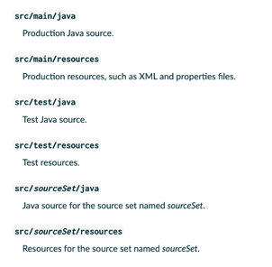

== Gradle: A Build Framework and Brief Example
This section's aim is to introduce you to Gradle which is one of the most commonly used build tools for JVM projects.

The first part of this section will introduce to general Gradle concepts while the second part is more hands-on.

=== Gradle Concepts
==== What is Gradle?
* Gradle is an open-source build tool (a program that automates the creation of executables from source code) that runs on the JVM.
* It aims to be very flexible while also making common projects (like Java applications) easy to configure out of the box.
* It strikes a balance between an imperative and a declarative style.

A build tool (Gradle being one instance of such tools) can handle many tedious tasks and free the time of developers: many builds tools offer dependency management (they handle downloading all the libraries and frameworks your code depends on). They can also run all your automated tests or enforce code conventions in your codebase. This frees up developer time and make their lives easier (bugs get caught early on, code quality looks better etc...)

==== The building blocks of Gradle
A gradle build consists of the following:

* A project: What you’re running gradle against (ie, your codebase)
* Tasks: The basic unit of work in Gradle. It’s an atomic piece of work you want to perform (compile, test)
* Plugins: Encapsulations of tasks that can be reused and imported into your projects.
* Dependencies: What your project needs to run (libraries, framework)

===== Gradle tasks
Tasks are the fundamental unit of work in Gradle. Everything you do with Gradle boils down to a task, or a combination of tasks.

A very basic Gradle task could look like this:

[source,groovy]
----
task helloWorld // declare the task

helloWorld { // define the task
    doLast {
        println("Hello world") // this is valid groovy syntax!
    }
}
----

However, you will see that for the most part, you are rarely defining tasks yourself, instead you "import" ready-to-use complex tasks into your project by using *plugins*.

===== Gradle plugins
Many projects require the same set of tasks. For example most java project will want to have some sort of task to compile their code. Most projects will have a suite of automated tests that should be run every time code changes are introduced.

_Imagine having to define your tasks every time you start a new project_ 🤔
_Imagine how messy projects become in a company with 500 projects_ 🤔

Why not encapsulate tasks that are often needed in a “package” you can reuse? This is what plugins do!

In short, a plugin does the following:

* Defines a set of tasks so you don’t have to rewrite them.
* Extends the Gradle DSL so you can declaratively set values that will be used by Gradle when performing the above tasks

The most important plugins you’ll be using are the Java plugin and the Application plugin which are both core plugins (provided by Gradle itself).

[source,groovy]
----
plugins { // import a plugin, referenced by id
    id 'application'
}

apply plugin: 'application' // this application plugin automatically applies the java plugin by default https://docs.gradle.org/current/userguide/application_plugin.html
----

*Note*: The Java plugin assumes your directory structure follows a specific convention.

===== Gradle dependency management

When working with dependencies you will often hear the following terms which we now define:

* A dependency is a piece of software you need, for instance a library you may be using in your project to perform some calculations. It can also be a dependency you need to run your tests (for instance Junit)
* Artifact is a file produced by a build such as a JAR file
* A repository (dependency repository) is the place where dependencies (as artifacts) live. It’s where you download them from.

*Dependency scope*:

A dependency may be needed at different phases of your project lifecycle (compile, tests, runtime). For instance, you don't need JUnit when your application is running and serving web requests and you don't want to overload your server with libraries it doesn't actually need to serve your clients.

In gradle you define the scope of your dependency via configurations.
A configuration is a named collection of dependencies grouped together for a specific goal (like running tests or compiling)
The java plugin you use will defines a bunch of configurations so you don’t need to write your own.

[source, groovy]
----
dependencies { // set dependencies. We only have a test dependency so we use the testImplementation scope coming from the Java plugin
    testImplementation 'junit:junit:4.13.2'
}
----

=== Gradle hands-on example

This section focuses on writing a Gradle (https://gradle.org/) build script that builds a single Gradle project referred to as _Computation_. The source code and tests for a Java application is available here: link:https://github.com/McGill-ECSE321-Fall2020/ecse321-tutorial-notes/raw/master/resources/Computation.zip[Computation.zip]. It is your job to create/reorganize the folder called _Computation_, move sources and tests into that folder, and produce the Gradle build script _build.gradle_ within this folder to automate the software build and testing process for this example project. 

First, open a terminal, and ensure you have the newest version  of Gradle (ver. 7.0+) installed with `gradle --version`.

Follow the steps below and add the snippets listed here to `build.gradle`, one after the other:

. Create the following folder structure and a new _build.gradle_ (empty) file within the _Computation_ folder:
+
[source,none]
----
Computation
├── build.gradle
└── src
    ├── main
    │   └── java
    │       ├── application
    │       │   └── CompApp.java
    │       ├── computation
    │       │   └── Computation.java
    │       └── view
    │           └── ComputationPage.java
    └── test
        └── java
            └── computation
                ├── AllTests.java
                ├── ComputationTestAddSubstract.java
                └── ComputationTestDivideMultiply.java
----
+

For Gradle to build your projects correctly, this is the expected file structure. The `src` folder is divided up into two subdirectories: `\main` (all application code goes here) and `\test` (all tests go here). There *MUST* be a `java` subfolder within both these subdirectories containing all code. If you do not follow this folder structure, you will need to define `SourceSets`. More on this later.

. Add the `java` and the `application` plugins to the build configuration script _build.gradle_. 
+
[source,gradle]
----
apply plugin: 'java'
// This plugin has a predefined 'run' task that we can reuse to use Gradle to execute our application
apply plugin: 'application'
----
+
A plugin is simply a set of useful tasks that bundled up that extend our project's capabilities. There are two types of plugins:
[horizontal]
Script:: additional build script that is declarative in manipulating the build.
Binary:: Classes that implement the plugin interface and programmatic in manipulating the build.
+
More information on plugins can be found link:https://docs.gradle.org/current/userguide/plugins.html[here].

. Add JUnit libraries to the `dependencies` section.
+
[source,gradle]
----
repositories {
    mavenCentral()
}
dependencies {
    testImplementation "junit:junit:4.12"
}
----
Dependencies are external files from other projects that our project relies on to compile, and/or test our source code. Gradle looks for dependencies in repositories. There is no default repository for Gradle so we have to specify one or several.

. Add and describe a new task `compile(type: JavaCompile)` to specify all source files (both application and test) and set the _build/bin_ as destination dir to put all compiled class files in. 
+
[source,gradle]
----
task compile(type: JavaCompile) {
  classpath = sourceSets.main.compileClasspath
  classpath += sourceSets.test.runtimeClasspath
  sourceSets.test.java.outputDir = file('build/bin')
  sourceSets.main.java.outputDir = file('build/bin')
}

task stage () {
    dependsOn ':Computation:assemble'
}
----
+
Tasks are blocks of work gradle must perform while building our project. Tasks can essentially do anything.
[NOTE]
One can specify source sets and their variables the following way:
+
[source,gradle]
----
/*
 * specifying sourceSets is not necessary in this case, since
 * we are applying the default folder structure assumed by Gradle
 */
sourceSets {
  main {
    java { srcDir 'src/main/java' }
  }
  test {
    java { srcDir 'src/test/java'}
  }
}
----
Although this isn't necessary, as we follow the default folder structure assumed by Gradle, it is still good practice to do this in case our folder structure changes.
. Specify the main class and run the application.
+
[source,gradle]
----
mainClassName='application.CompApp'
----
+
In the command line issue `gradle run`

. Describe the `jar` Gradle task (defined by the `java` plugin) to produce an executable jar file into `distributable/`.
+
[source,gradle]
----
jar {
  destinationDir=file('distributable')
  manifest { 
    // It is smart to reuse the name of the main class variable instead of hardcoding it
    attributes "Main-Class": "$mainClassName"
  }  
}
----

. Create the `settings.gradle` file and add the following line:

+
[source,gradle]
----
include ':Computation'
----