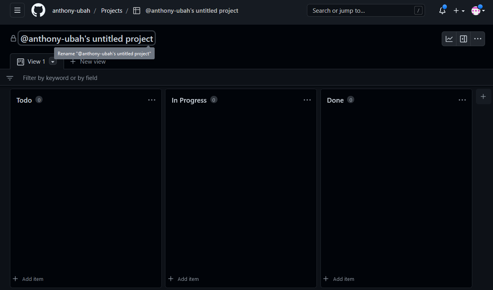
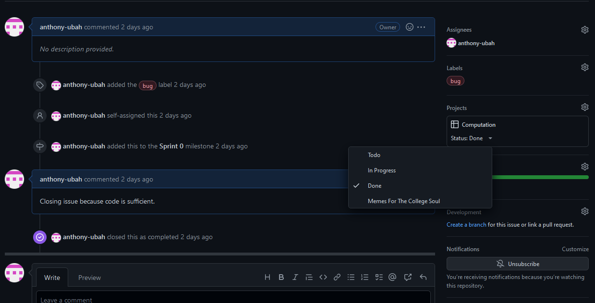
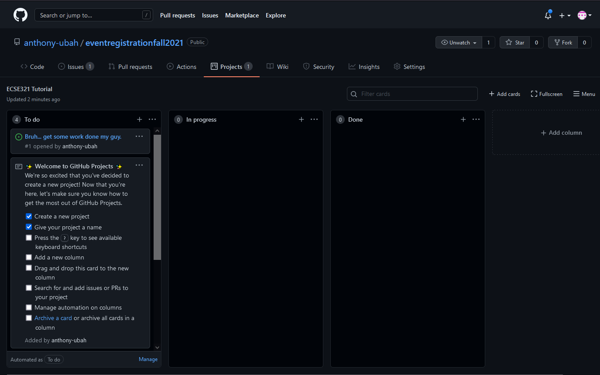
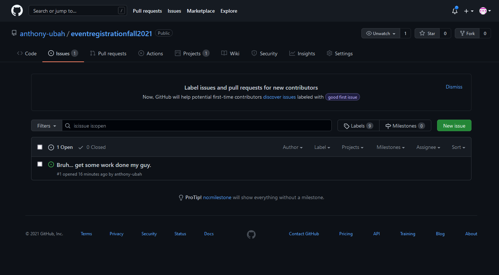
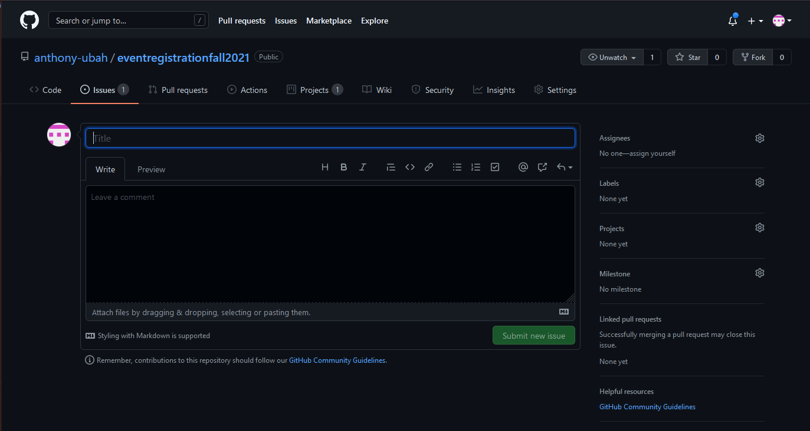
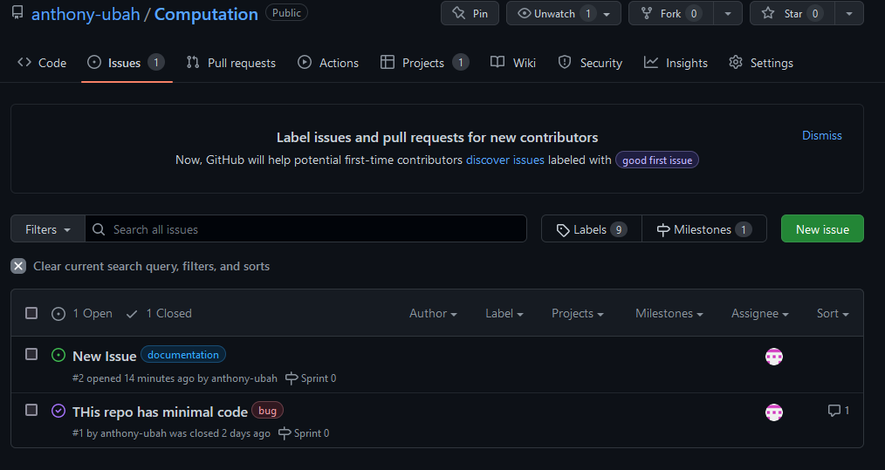

=== GitHub Project Repository

One of the core components of Agile development is being able to manage the development problem space. GitHub projects extends GitHub's utility to make problem space management easy. 

Any repository can be added to a project by selecting the _Create New Project_ button located in the _Project_ tab of the repository. 

image::figs/GitProj5.png[]

Below is the layout of the Basic KanBan Board.

By default there are three columns: *To do*, *In progress* and *Done*. More columns can be added by clicking the add column area. 

Issues that exist already on the GitHub issue board can be searched by filter, then dragged and dropped into the board space. This is done by clicking _Add cards_ at the top right corner. 

image::figs/GitProj7.PNG[GitHub project cards]

It is generally prudent as a software engineer to automate away tedious tasks. You only need to automate it once. You can select various automation actions by clicking the ellipsis (...) at the top right corner of each board. 

That way when you create an issue on the issue board, close an issue etc. it is automatically added to the proper column. 

To help with better management of the project as you move through project phases, it is prudent to add Milestones. A new milestone can be created by selecting the _Issues_ tab in the repository, and selecting the _Milestones_ tab located next to the _New issue_ button. 

To create a new milestone, select the _New Milestone_ button. Then, fill out the form with an appropriate name, due date and description. Once your milestone has been created, you can attach issues to the milestone and see their progress by selecting the _Milestones_ tab.

image::figs/GitProj11.PNG[GitHub project milestone creation button]
To help with better management of the project as you move through project phases, it is prudent to add Milestones. A new milestone can be created by selecting the _Issues_ tab in the repository, and selecting the _Milestones_ tab located next to the _New issue_ button. 

To create a new milestone, select the _New Milestone_ button. Then, fill out the form with an appropriate name, due date and description. Once your milestone has been created, you can attach issues to the milestone and see their progress by selecting the _Milestones_ tab.

image::figs/GitProj11.PNG[GitHub project milestone creation button]

image::figs/GitProj12.PNG[GitHub project milestone tracking]

Finally, you can create issues to track. This is very straight forward, (select _New issue_ button under the _Issues_ tab of the repository), so the rest of this section will deal with some best practices when tracking issues in this course.

When creating a new issue it is imperative to be concise but also as descriptive as possible. All the issues you create should have a title, with a comment to describe the issue in detail. 

All issues at the time of creation should be assigned to someone. You can always change this later. Label your issues. If none of the default labels fit, new labels can be created to meet your need. This is accomplished by selecting the _Labels_ tab next to the _Milestones_ tab under the _Issues_ section. Then click the _New Label_ button. Finally, assign your issue to the appropriate milestone and project. +

For the purpose of tracking progress through the project, never ever ever delete issues. Issues should be closed and reopened as needed but never deleted. Even if a mistake was made during creation of an issue, issues can be edited by their creator.

If you've set everything up correctly. Your issue board should match your KanBan board. The KanBan board should be a snapshot of how the project is going. Nothing should be done manually here. All the manual labor of opening, moving and triaging issues should be done on the issue board, with automated results appearing on the KanBan board. 

image::figs/GitProj15.PNG[GitHub project issue creation]
